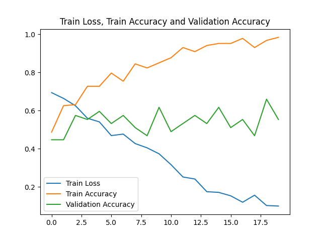
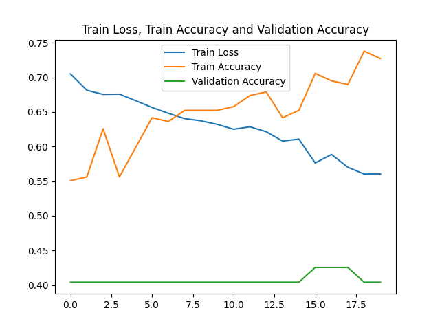

# Models
## Introduction
I have mostly been working on the binary classification problem (AD vs CN). I began by going through a few research papers and decided to implement the paper: *AXIAL: Attention-based eXplainability for Interpretable Alzheimer’s Localized Diagnosis using 2D CNNs on 3D MRI brain scans*. Their approach is to pass a fixed number of slices (which is a hyperparameter) through a common 2D CNN backbone and then merge feature vectors obtained through each slice using a weighted sum. I have been using the 9GB of data shared before the mid-eval instead of the 85 GB one. Unfortunately, the data seems to be too small, which is probably why I haven't got very good results.  
  
P.S.: I spent a long time on an ambitious project that I had to drop. The MRI scans are a sequence of slices, and so I thought that it would make sense to use a sequential model. So I tried fine-tuning a Vision Transformer (ViT) on the data. It also makes sense, since the attention mechanism is particularly well-suited for finding unobvious spatial correlations. However, the idea didn't work out for 2 reasons:  
1. The VRAM available in Kaggle Notebooks is not sufficient for training a model like VIT.
2. The 9GB dataset consists of only ~450 samples, out of which only ~200 samples can be used for the AD vs CN problem, since the rest are labelled "MCI". Training transformers requires more data than that.

However, I think this approach is worth considering with the 85 GB dataset and if we ever get sufficient resources.

## Methodology
### Motivation behind the Approach 
As outlined in the paper, there are primarily 3 approaches to this classification problem.
1. 3D CNN
2. 3D Patch-Based CNN: They extract 3D sub-volumes from the scan and analyse those instead of analysing the entire brain
3. 2D CNN

3D CNNs are very computationally intensive and will easily overfit on a small dataset such as this. Also, there aren't too many pre-trained models to try out transfer learning (I know there's 3D ResNet, but still!). 3D patch-based CNNs solve some of the computational problems, but I think it would still be difficult on a small dataset. Additionally, I'm unsure if it would work out on the limited GPU space. Also, it's just a complex approach to start with.  
Coming to the 2D CNNs. They are computationally more efficient and also don't overfit as much since the number of slices is decent even in smaller datasets. However, most 2D approaches predict on every slice, which means they don't capture the spatial features very well. The approach outlined in the research paper solves this problem. They pass all the slices through a common CNN backbone, which means a feature vector is obtained corresponding to every slice (The Approach is kind of similar to RNN). The obtained feature vectors are combined through a weighted sum. The final feature vector is passed through the output layer.  
You may have realised that this approach only allows us to use slices from a single plane. The paper points out that the model performs best with the Axial planes (Which was expected), and so I did all my experiment with the axial slices.  

To be clear, since pre-processing was taking too long, I did all these experiments without pre-processing. However, the results haven't been very encouraging. This may show us the importance of pre-processing.

## Implementation
I used PyTorch for all the experiments.
### The Code Structure
#### Step 1: Traversed the dataset directory and added the `path` column to the CSV file.
The path column contains the path to the corresponding scan. This made it convenient to implement the dataset class.

#### Step 2: Creating the dataset class:
```python
code = {'AD':1, 'CN':0}
class ADNIAxialDataset(Dataset):
    def __init__(self, csv_path, transform=None, n_slices=80):
        self.df = pd.read_csv(csv_path)
        self.df = self.df[self.df.Group != "MCI"]
        self.transform = transform
        self.n_slices = n_slices

    def __len__(self):
        return len(self.df)

    def __getitem__(self, idx):
        path = self.df.iloc[idx]['path']
        label = code[self.df.iloc[idx]['Group']]

        img = nib.load(path).get_fdata()  # shape: (H, W, D)
        img = np.transpose(img, (2, 0, 1))  # axial: (D, H, W)

        center = img.shape[0] // 2
        start = center - self.n_slices // 2
        end = center + self.n_slices // 2
        slices = img[start:end]  # shape: (n_slices, H, W)

        if self.transform:
            slices = torch.stack([self.transform(slice_) for slice_ in slices])
        else:
            slices = torch.tensor(slices).unsqueeze(1).float()  # (N, 1, H, W)

        return slices, label
```
#### Step 3: Defining the Fusion Layer:
This is the layer that combines the features. The separate implementation of this layer will help generate attention maps later. We have also applied softmax to the weights so that they sum up to 1.
```python
class AttentionFusion(nn.Module):
    def __init__(self, fdim):
        super().__init__()
        self.attn = nn.Linear(fdim, 1)

    def forward(self, features):  # (B, N, fdim)
        weights = self.attn(features).squeeze(-1)  # (B, N)
        alpha = torch.softmax(weights, dim=1).unsqueeze(-1)  # (B, N, 1)
        fused = (alpha * features).sum(dim=1)  # (B, fdim)
        return fused
```
#### Step 4: Defining the Overall Model:
```python
class AXIALModel(nn.Module):
    def __init__(self, base='vgg16'):
        super().__init__()
        base_model = #the model you want
        self.features = base_model.features
        self.features[:].requires_grad_(False)#Freeze how many ever layers required
        self.pool = nn.AdaptiveAvgPool2d((1, 1))
        self.flatten = nn.Flatten()
        self.fdim = # Depends on the Model being imported
        self.dropout = nn.Dropout(0.3)

        self.attn_fusion = AttentionFusion(self.fdim)
        self.classifier = nn.Linear(self.fdim, 2)

    def forward(self, x):  # x: (B, N, 1, 224, 224)
        B, N, _, H, W = x.shape
        x = x.view(B * N, 1, H, W)
        x = x.repeat(1, 3, 1, 1)  # convert to 3 channels
        x = self.features(x)
        x = self.pool(x)
        x = self.flatten(x)  # (B*N, fdim)
        x = x.view(B, N, -1)
        fused = self.attn_fusion(x)
        fused = self.dropout(fused)
        out = self.classifier(fused)
        return out
```
#### Step 5: The Training Function
I've used PyTorch GradScaler to boost the efficiency of the training algorithm. It allows me to use higher batch sizes.
```python
from tqdm import tqdm
def train_model(model, train_loader, val_loader, epochs, device):
    model.to(device)
    optimizer = torch.optim.AdamW(model.parameters(), lr=1e-4, weight_decay=1e-2)
    class_weights = compute_class_weight('balanced', classes=[0, 1], y=(df["Group"]=="AD").values)
    class_weights = torch.tensor(class_weights, dtype=torch.float).to(device)
    criterion = nn.CrossEntropyLoss(weight=class_weights)
    
    best_acc = 0

    for epoch in range(epochs):
        model.train()
        losses, preds, labels = [], [], []
        scaler = torch.amp.GradScaler('cuda')
        
        for x, y in tqdm(train_loader):
            x, y = x.to(device), y.to(device)
            
            with torch.amp.autocast("cuda"):
                out = model(x)
                loss = criterion(out, y)

            scaler.scale(loss).backward()
            scaler.step(optimizer)
            scaler.update()
            optimizer.zero_grad()

            losses.append(loss.item())
            preds.extend(out.argmax(1).cpu().numpy())
            labels.extend(y.cpu().numpy())
        acc = accuracy_score(labels, preds)
        print(f"[Epoch {epoch+1}] Train Loss: {sum(losses)/len(losses):.4f}, Acc: {acc:.4f}")

        # Validation
        model.eval()
        val_preds, val_labels = [], []
        with torch.no_grad():
            for x, y in val_loader:
                x, y = x.to(device), y.to(device)
                out = model(x)
                val_preds.extend(out.argmax(1).cpu().numpy())
                val_labels.extend(y.cpu().numpy())

        val_acc = accuracy_score(val_labels, val_preds)
        print(f"          Val Acc: {val_acc:.4f}")
        if val_acc > best_acc:
            best_acc = val_acc
            torch.save(model.state_dict(), "best_model.pth")
        torch.cuda.empty_cache()
```
#### Step 6: Final Few steps:
```python
transform = T.Compose([
    T.ToPILImage(),
    T.Resize((224, 224)),
    T.ToTensor(),
])

df = pd.read_csv("/kaggle/input/adni-csv-with-path/adni_with_path.csv")
df = df[df.Group != 'MCI']
train_idx, val_idx = train_test_split(range(len(df)), test_size=0.2, stratify=df["Group"])

train_ds = ADNIAxialDataset("/kaggle/input/adni-csv-with-path/adni_with_path.csv", transform=transform)
val_ds = ADNIAxialDataset("/kaggle/input/adni-csv-with-path/adni_with_path.csv", transform=transform)

train_loader = DataLoader(Subset(train_ds, train_idx), batch_size=32, shuffle=True, num_workers=2)
val_loader = DataLoader(Subset(val_ds, val_idx), batch_size=4, shuffle=False, num_workers=2)

model = AXIALModel()
device = torch.device("cuda" if torch.cuda.is_available() else "cpu")
train_model(model, train_loader, val_loader, epochs=20, device=device)
```
### Experimentation
I tried to fine-tune it on 2 architectures, the VGG16(With Batch Normalisation) and Mobilenet. I used P100 for most of the experimentation.
#### VGG 16
VGG 16 is a heavy model. Requires very careful calibration so that everything fits in the GPU VRAM(16GB).
Batch Size: 8  
Optimiser: AdamW  
Learning rate: 0.0001  
weight_decay: 0.001  
Epochs: 20  
No. of layers frozen: 20  
I could keep the batch size as 8 after applying the gradient-scaler optimisation. Without it, I could only keep the batch size to 2. However, this didn't work very well.

#### MobileNet
I thought that the VGG net may be too big for such small datasets. So I decided to try a smaller pre-trained network named MobileNet.
Batch Size: 32  
Optimiser: AdamW  
Learning rate: 0.0001  
weight_decay: 0.001  
Epochs: 20  
No. of layers frozen: 10  
This model is lighter, so it allowed me to take a higher batch size. However, this didn't work well either.

## Results
### VGG-16

While the training accuracy is rising, the validation accuracy is just oscillating, probably because of overfitting. Indicates that the data is too less for this model. 
### MobileNet
  
There's something very wrong with the validation accuracy. I couldn't find any issue with the validation code. I'm assuming that it's because of a lack of regularisation in MobileNet. But I'm looking for a better explanation; it shouldn't be this bad.

# Conclusions
The main conclusion I have drawn is that the data is too less for this approach. I am considering to try training simple CNN in on this model. However, I think I need to figure out something else. The poor performance may also be due to no pre-processing. So I am now working on pre-processing the entire dataset first.
There are also some shortcomings with this approach. I feel that the fusion of slices through a weighted sum is too simple and may not capture all the patterns well. Also I think it would be ideal if we could somehow fuse features extracted from all the planes and not just axial. For this, maybe we can train 3 separate models on each plane and then try to fuse the feature vectors obtained using some operation like attention. I also feel intuitively that when going with the 2D approach, some kind of a sequential model will work better because it will allow us to capture more complex correlations.  


** I'm sorry if this documentation seems a bit unprofessional. I've typed this all out by hand and didn't get much time to proofread. I am sure I would have committed many errors, here and there.**
